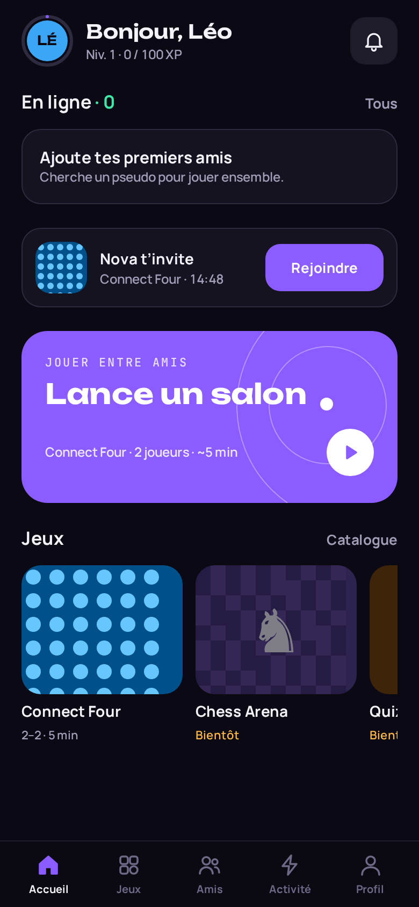
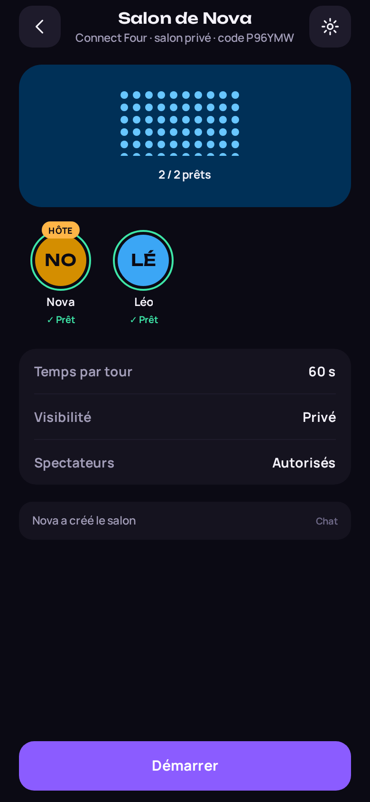
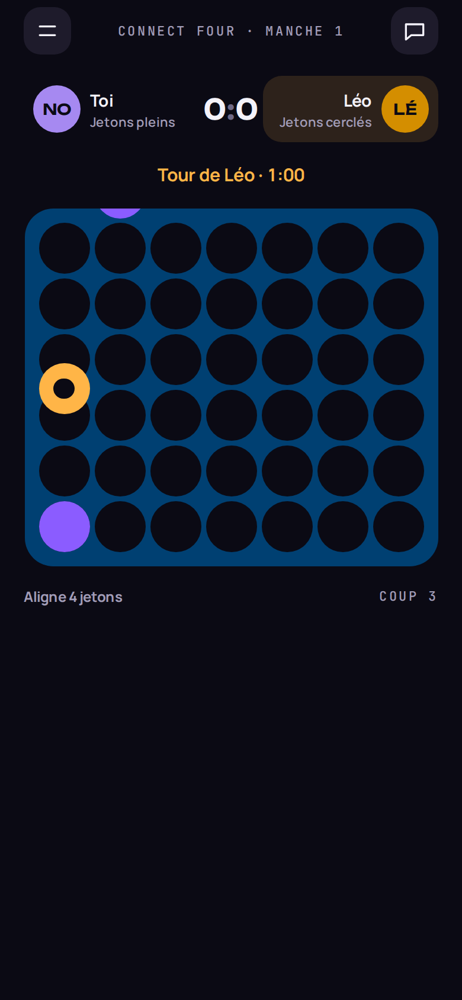
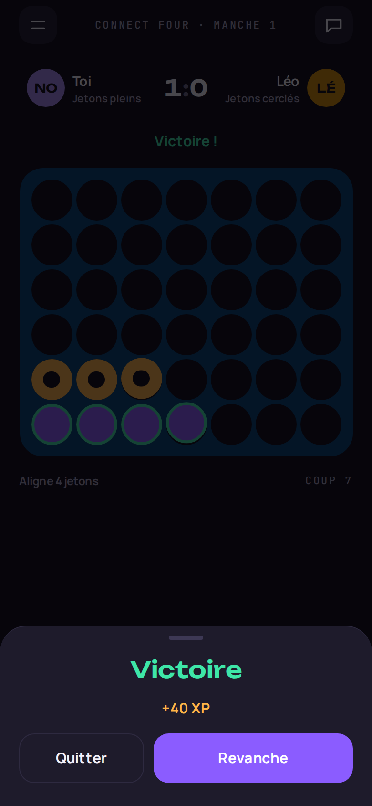
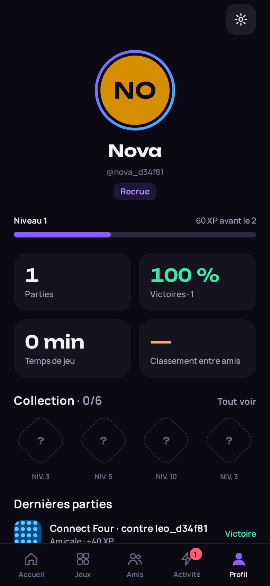

# PARTYVERSE

**PLAY TOGETHER. COMPETE. CONNECT.**

Plateforme sociale de mini-jeux multijoueurs — iOS et Android d'abord (Expo / React Native), web préparé.
Backend Supabase (PostgreSQL, Auth, Realtime, Edge Functions) avec des règles de jeu **autoritaires côté serveur**.

| Accueil | Salon | Connect Four | Résultat | Profil |
| --- | --- | --- | --- | --- |
|  |  |  |  |  |

_Captures prises automatiquement par le test de bout en bout (`npm run test:e2e`) contre un vrai backend local._

## Ce qui fonctionne (v0.1)

- **Comptes** : inscription e-mail, confirmation et réinitialisation par lien profond (PKCE), restauration de session, déconnexion de tous les appareils, suppression de compte (Edge Function).
- **Onboarding** : pseudo unique vérifié en direct, avatar, jeux préférés, suggestions d'amis facultatives.
- **Profils** : niveau/XP, titre, statistiques par jeu, historique, collection cosmétique attribuée par le serveur, confidentialité (stats publiques ou amis).
- **Social** : recherche, demandes d'ami (politiques : tous / amis d'amis / personne), présence réelle (heartbeat), statuts (en ligne, absent, occupé, invisible), « rencontrés récemment », blocage, signalement avec preuves capturées côté serveur.
- **Salons** : création (privé à code ou public), réglages par jeu validés serveur, prêts / démarrage, démarrage auto, transfert d'hôte, exclusion, spectateurs, chat avec messages rapides, filtre et limitation de débit, invitations (expiration 15 min), lien `partyverse://join/CODE`, nettoyage automatique.
- **Connect Four** : coups validés et persistés par le serveur (verrou de ligne + version), chrono autoritaire, abandon, déconnexion = défaite au temps, revanche (le perdant commence), score de la série, XP et statistiques, **partie classée** via matchmaking Elo.
- **Catalogue** des 10 jeux, honnête : seuls les jeux dont le moteur existe sont jouables ; les autres sont « Bientôt disponible ».

Voir [docs/roadmap.md](docs/roadmap.md) pour la suite et les limites connues.

## Démarrage

```bash
npm install
cp .env.example .env          # renseigner l'URL et la clé anon Supabase
npx supabase db push          # applique supabase/migrations au projet lié
npx expo start                # puis i (iOS), a (Android) ou w (web)
```

Sans variables d'environnement, l'application affiche un écran « Configuration requise » au lieu de simuler un backend.
Configuration complète (redirections Auth, Edge Function, pg_cron, Realtime) : [docs/setup.md](docs/setup.md).

> Expo Go suffit pour cette version (aucun module natif hors SDK). Un development build reste recommandé pour la suite.

## Scripts

| Commande | Rôle |
| --- | --- |
| `npm run typecheck` | TypeScript strict (`noUncheckedIndexedAccess`) |
| `npm run lint` | ESLint (config Expo, règles React Compiler) |
| `npm test` | Tests unitaires + composants (Jest, jest-expo, Testing Library) |
| `npm run test:db` | Tests d'intégration SQL sur un PostgreSQL 16 jetable (RLS, RPC, règles de jeu) |
| `npm run test:e2e` | Bout en bout : Postgres + Supabase Auth + PostgREST + build web + 2 joueurs Playwright |
| `npm run check` | typecheck + lint + tests |

Détails : [docs/testing.md](docs/testing.md).

## Architecture en bref

```
src/app/            Routes Expo Router (écrans uniquement, pas de logique métier)
src/design-system/  Jetons (couleurs, typo, rayons), composants UI, couleurs OKLCH des jeux
src/features/       Domaines : auth, onboarding, profile, social, lobbies, matches,
                    matchmaking, notifications, games/<jeu> (moteur, rendu, présentation)
src/lib/            Client Supabase, RPC validées par Zod, erreurs, horloge serveur
supabase/           migrations/ (schéma + RLS + RPC), functions/ (Edge Functions), tests/
tests/              db/ (intégration SQL), e2e/ (bout en bout), fixtures/ (vecteurs partagés)
docs/               Architecture, base de données, multijoueur, design, roadmap
```

- [Vue d'ensemble et choix structurants](docs/architecture/overview.md)
- [Base de données, RLS et RPC](docs/architecture/database.md)
- [Modèle multijoueur](docs/architecture/multiplayer.md) · [Salons](docs/architecture/lobbies.md) · [Présence](docs/architecture/presence.md)
- [Design system et écarts avec la maquette](docs/design/README.md)
- [Progression et XP](docs/game-design/progression.md)
- [Exploitation](docs/operations.md)
