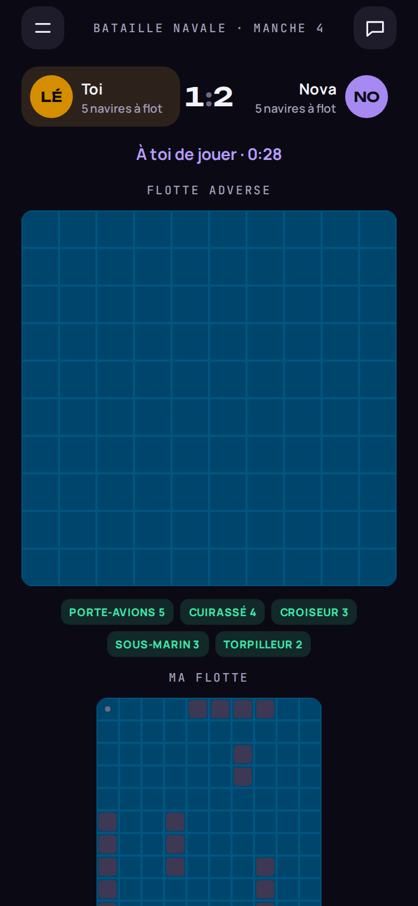
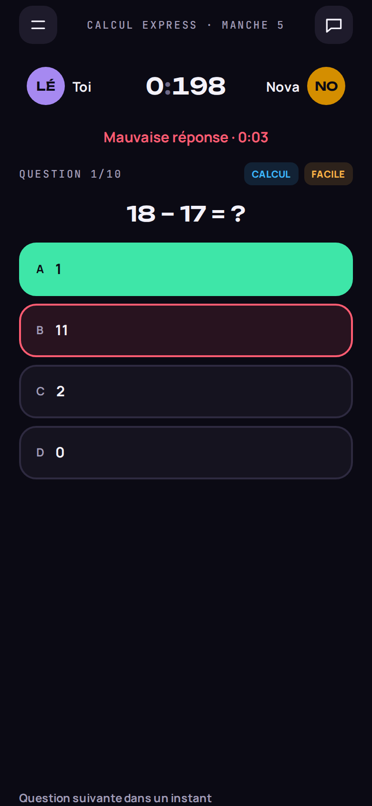
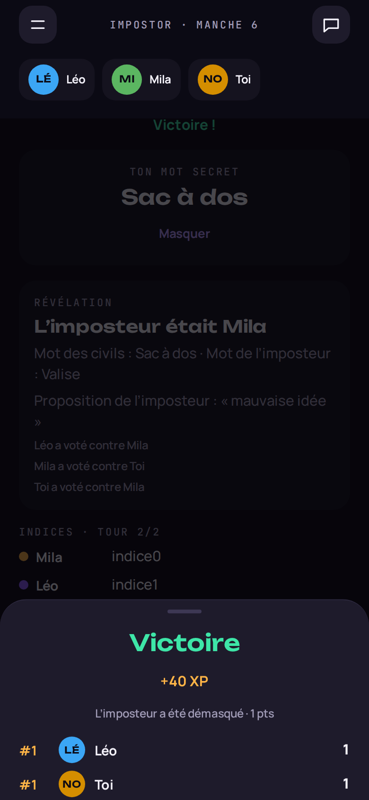
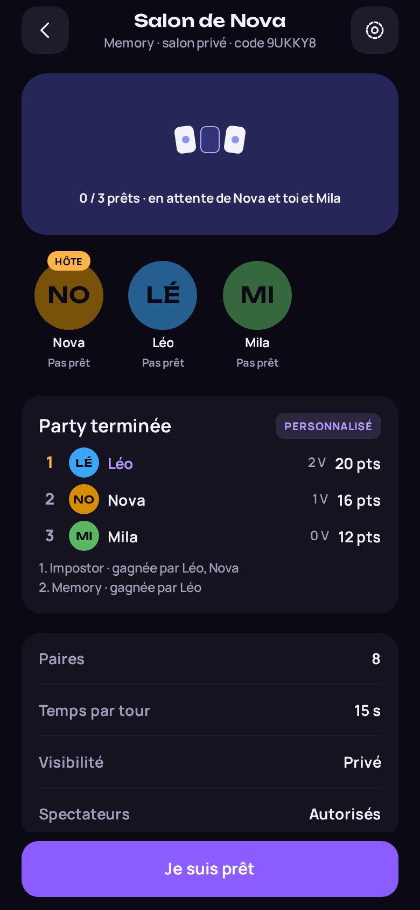
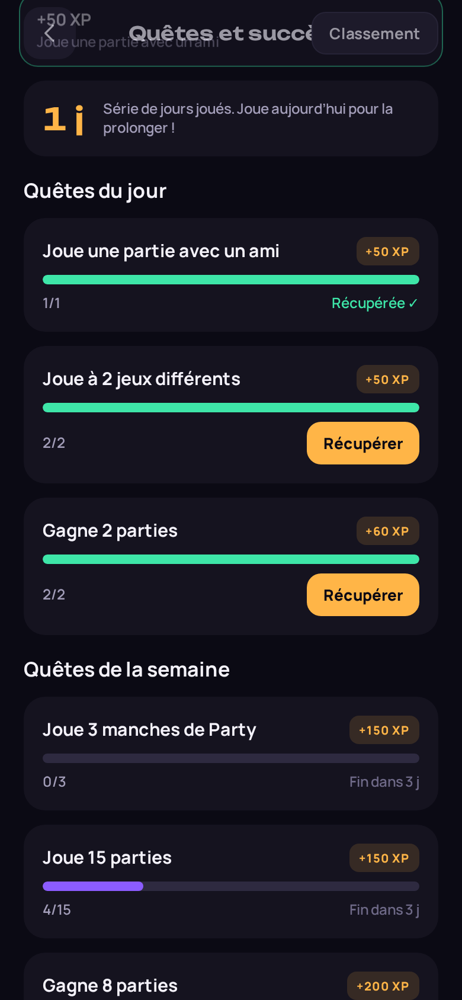

# PARTYVERSE

**PLAY TOGETHER. COMPETE. CONNECT.**

Plateforme sociale de mini-jeux multijoueurs — iOS et Android d'abord (Expo / React Native), web préparé.
Backend Supabase (PostgreSQL, Auth, Realtime, Edge Functions) avec des règles de jeu **autoritaires côté serveur**.

| Accueil | Salon | Bataille navale | Calcul Express | Impostor | Party | Quêtes |
| --- | --- | --- | --- | --- | --- | --- |
|  |  |  |  |  |  |  |

_Captures prises automatiquement par le test de bout en bout (`npm run test:e2e`) contre un vrai backend local._

## Ce qui fonctionne (v0.2)

- **10 jeux jouables, règles côté serveur** : Connect Four, Morpion, Chess Arena (pendule, Bullet/Blitz/Rapide, Elo par cadence), Reversi, Dames, Bataille navale (flottes secrètes), Quiz Rush (90 questions, 9 catégories), Calcul Express, Impostor (3–12 joueurs, rôles et votes secrets), Memory. Délais, abandons, départs, revanche, historique. Règles : [docs/game-design/rules.md](docs/game-design/rules.md).
- **Party** : plusieurs jeux enchaînés dans le même salon (Classique, Rapide, Entre amis, Compétitif, Personnalisé), classement général, manches rejouées si annulées.
- **Salons** : privé à code ou public, partie rapide, choix et réglages du jeu, places, prêts, démarrage, transfert d'hôte, exclusion, spectateurs, chat, invitations, lien `partyverse://join/CODE` (rejoué après inscription).
- **Social** : profils (confidentialité), amis, présence réelle et statuts, favoris, blocage, signalement avec preuves, **messages privés** (lu/non-lu, anti-spam), **groupes** (rôles, chat, classement de la semaine, activité, défi collectif, salon de groupe).
- **Progression** : XP/niveaux et cosmétiques, Elo par jeu et mode, **19 succès**, **quêtes quotidiennes et hebdomadaires**, série de jours, classements par jeu et XP (monde / amis).
- **Notifications** : in-app et **push Expo** (opt-in, préférences par type, rappel du soir, ouverture au bon écran même app fermée) — vérifiées jusqu'à l'API Expo, pas sur un téléphone réel.
- **Comptes** : inscription e-mail, confirmation et réinitialisation par lien profond (PKCE), sessions sécurisées, déconnexion de tous les appareils, suppression de compte.

Les 6 jeux temps réel (dessin, billard, mini-golf, course…) restent « Bientôt disponible » et ne sont jamais proposés comme jouables.
Voir [docs/roadmap.md](docs/roadmap.md) pour les limites connues et la suite.

## Démarrage

```bash
npm install
cp .env.example .env          # renseigner l'URL et la clé anon Supabase
npx supabase db push          # applique supabase/migrations au projet lié
npx expo start                # puis i (iOS), a (Android) ou w (web)
```

Sans variables d'environnement, l'application affiche un écran « Configuration requise » au lieu de simuler un backend.
Configuration complète (redirections Auth, Edge Function, pg_cron, Realtime) : [docs/setup.md](docs/setup.md).

> Expo Go suffit pour tout sauf les notifications push, qui demandent un development build (EAS) — voir [docs/setup.md](docs/setup.md#6-tester-sur-un-vrai-téléphone).

## Scripts

| Commande | Rôle |
| --- | --- |
| `npm run typecheck` | TypeScript strict (`noUncheckedIndexedAccess`) |
| `npm run lint` | ESLint (config Expo, règles React Compiler) |
| `npm test` | Tests unitaires + composants (Jest, jest-expo, Testing Library) |
| `npm run test:db` | Tests d'intégration SQL sur un PostgreSQL 16 jetable (RLS, RPC, règles de jeu) |
| `npm run test:e2e` | Bout en bout : Postgres + Supabase Auth + PostgREST + Edge Functions (Deno) + build web + 3 joueurs Playwright |
| `npm run check` | typecheck + lint + tests |

Détails : [docs/testing.md](docs/testing.md).

## Architecture en bref

```
src/app/            Routes Expo Router (écrans uniquement, pas de logique métier)
src/design-system/  Jetons (couleurs, typo, rayons), composants UI, couleurs OKLCH des jeux
src/features/       Domaines : auth, onboarding, profile, social, lobbies, matches,
                    matchmaking, notifications, games/<jeu> (moteur, rendu, présentation)
src/lib/            Client Supabase, RPC validées par Zod, erreurs, horloge serveur
supabase/           migrations/ (schéma + RLS + RPC), functions/ (game-action, push-dispatch,
                    delete-account, _shared/engines : moteurs de jeu TypeScript), tests/
tests/              db/ (intégration SQL), e2e/ (bout en bout), fixtures/ (vecteurs partagés)
docs/               Architecture, base de données, multijoueur, design, roadmap
```

- [Vue d'ensemble et choix structurants](docs/architecture/overview.md)
- [Moteurs de jeu et informations cachées](docs/architecture/games.md) · [Règles des jeux](docs/game-design/rules.md)
- [Social : messages, groupes, confidentialité](docs/architecture/social.md) · [Notifications push](docs/architecture/push.md)
- [Mise en place](docs/setup.md) · [Migrations](docs/migrations.md) · [Déploiement](docs/deploy.md) · [Tests](docs/testing.md)
- [Base de données, RLS et RPC](docs/architecture/database.md)
- [Modèle multijoueur](docs/architecture/multiplayer.md) · [Salons](docs/architecture/lobbies.md) · [Présence](docs/architecture/presence.md)
- [Design system et écarts avec la maquette](docs/design/README.md)
- [Progression et XP](docs/game-design/progression.md)
- [Exploitation](docs/operations.md)
